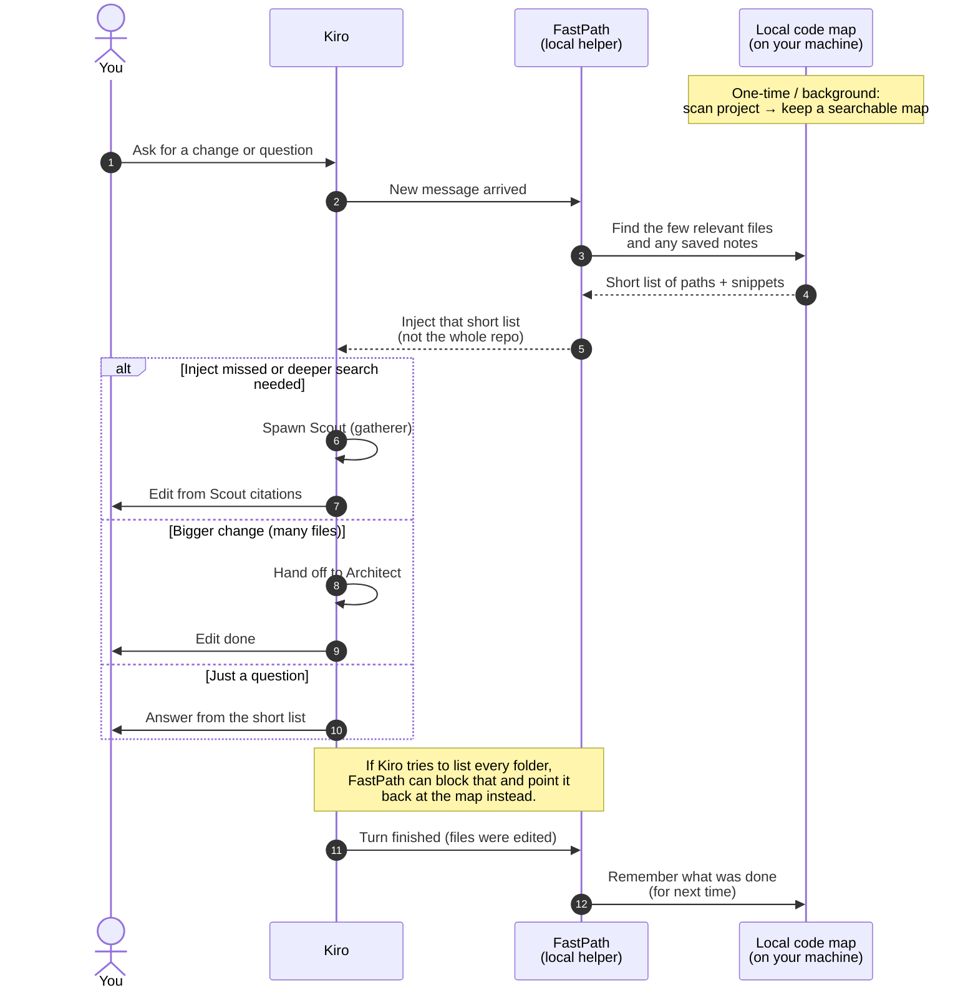

<p align="center">
  
</p>

# Kiro FastPath

Warm local hybrid code index + thin MCP + **Scout** / **Architect** agents for **Kiro IDE**.
The installer writes Kiro IDE artifacts (`.kiro/agents`, `.kiro/hooks`, `.kiro/settings/mcp.json`);
`fastpath` itself is a normal terminal CLI, but Kiro-CLI agent profiles are not generated.

Makes Kiro **retrieve → act** instead of packing the workspace and over-exploring.

> Git repo: **kiro-fastpath**. Clone into `~/kiro-fastpath` on each machine. Not an `npx`-only MCP — needs a local home (index, MiniLM, inject hook, agents).

Support matrix / release gate: `scripts/SUPPORT_MATRIX.txt`, `scripts/RELEASE_GATE.txt`, `scripts/CHANGELOG.txt`.

## How it works

Without FastPath, Kiro often walks your whole project looking for the right files. That burns a lot of tokens. FastPath builds a local map of your code once, then hands Kiro only the few files that matter for each question.



**In short:**

1. FastPath keeps a **local map** of your project (and short notes from past turns).
2. Every time you send a message, it **looks up** a few matching files — not the whole tree.
3. Those results are **pasted into Kiro’s context** automatically.
4. Default **edits**. Spawn **Scout** when inject missed; **Architect** for bigger work.
5. When a turn ends, FastPath **remembers** what changed so the next session starts smarter.

## How is this different?

Same neighborhood as tools like [KiroGraph](https://github.com/davide-desio-eleva/kirograph) and common “memory” add-ons — but not the same job.

|                                         | FastPath                              | KiroGraph                                  | Common memory tools                           |
| --------------------------------------- | ------------------------------------- | ------------------------------------------ | --------------------------------------------- |
| Main job                                | Stop Kiro from walking the whole repo | Give Kiro a deep map of how code connects  | Remember what was said / decided across chats |
| Knows where code lives?                 | Yes (search, symbols, snippets)       | Yes, plus richer “who calls whom” analysis | Usually no                                    |
| Remembers past decisions?               | Yes, but small and simple             | Yes (optional, richer)                     | That’s their whole product                    |
| Blocks wasteful folder listing?         | Yes (guardrail)                       | Soft reminders / agent habits              | No                                            |
| Ships ready agents (Scout / Architect)? | Yes                                   | No (tools for whatever agent you use)      | No                                            |

**vs KiroGraph** — both keep a local map so Kiro doesn’t re-scan the tree. KiroGraph goes deep (call chains, dead code, architecture checks, optional heavy memory). FastPath stays thin: auto-paste a few hits into every prompt, route small vs big work, and block “list every folder.” Think atlas + lab vs GPS that only shows the next few turns.

**vs common memory tools** (Mem0, Engram, cavemem, “remember this”, etc.) — those mostly answer _“what did we decide last week?”_ They usually don’t answer _“which file has `validateJwt`?”_ Without a code map, the agent still explores the tree — and that’s where most tokens go. FastPath’s notes are a small add-on on top of the code map; the map is the main savings.

**When to pick what**

- Daily locate-and-edit with fewer tokens → **FastPath**
- Deep structural questions (impact, dead code, architecture) → **KiroGraph**
- Chat / preference memory across products, no code index → a normal mem tool

You can combine them in theory; for one tool, FastPath’s bet is **forced retrieval before exploration**, not the biggest knowledge graph.

## Architecture

| Layer         | Tech                                                      |
| ------------- | --------------------------------------------------------- |
| Store         | SQLite `.fastpath/index.db` (WAL)                         |
| Lexical       | FTS5 BM25                                                 |
| Regex speedup | Sparse n-gram inverted index                              |
| Semantic      | MiniLM (`@huggingface/transformers`) + RRF; hash fallback |
| ANN           | LSH (+ optional `sqlite-vec`)                             |
| Graph         | Import edges + `call_edges`                               |
| Symbols       | web-tree-sitter (legacy TS/regex fallback)                |
| Freshness     | Prompt-inject delta, `watch`, `index --git`               |
| Delivery      | MCP stdio — 4 tools (`find` / `impact` / `window` / `memory`) |
| Harness       | Scout / Architect + steering + doctor                     |

## Make Kiro actually use the index

Indexing alone does nothing. Kiro only uses FastPath when all four exist:

1. **Auto-inject** — `.kiro/hooks/fastpath-context.json`: `UserPromptSubmit` injects retrieved code + memories + a routing hint; `SessionStart` warms and catches up git deltas; `PostFileSave/Create/Delete` keep the index fresh at save time; `Stop` captures a session memory.
2. **Guardrail** — `PreToolUse` hook logs and (configurably) blocks directory walks and recursive shell discovery (`grep -r` / `rg` / `find`); `FASTPATH_GUARDRAIL=auto|warn|block|off`.
3. **Tool binding** — agents have inline `mcpServers.fastpath` + `tools: [..., "@fastpath"]`.
4. **Behavior** — steering + agent prompts: max ~3 file reads, no repo walks, recall memory before re-deriving.

`install-target` / `use` / `install-kiro` install all of it. Then stay on **Default** (spawn Scout to gather) and enable the hooks in Kiro Hook UI.

## Quick start (git — recommended)

**Once per machine** (office or home):

```bash
# Keep a git checkout (e.g. Documents). Install copies it into ~/kiro-fastpath.
git clone <kiro-fastpath-url> ~/Documents/kiro-fastpath
cd ~/Documents/kiro-fastpath && npm install && npm run build && npm run build:ui
unset FASTPATH_HOME   # important — never point home at the git checkout
fastpath ui           # guided setup in the browser (see `fastpath ui` below)
# or CLI-only:
bash ~/Documents/kiro-fastpath/scripts/install-home.sh ~/Documents/kiro-fastpath
source ~/.zshrc       # enables `fastpath` + FASTPATH_HOME=~/kiro-fastpath
```

`install-home` takes the **kiro-fastpath** checkout — not your app repo. It copies into **`~/kiro-fastpath`** (separate from the git checkout), then puts `fastpath` on your PATH. **Do not** set `FASTPATH_HOME` to the same path as the checkout — that wipes the tree.

The **Setup** screen in `fastpath ui` walks the same steps: copy into home → download models → connect your app repo and build the first index. When everything is ready, the UI opens on **Repos** next time.

**Per project workspace:**

```bash
bash "$FASTPATH_HOME/scripts/install-target.sh" /path/to/your-repo
# or: fastpath use /path/to/your-repo
# or: Repos screen in `fastpath ui` → Add a repo
```

**In Kiro:**

1. Reload window
2. Agent picker → **Default** (daily) or **Architect** (multi-file). Spawn **Scout** to gather when inject misses.
3. Hook UI → enable all **fastpath-\*** hooks
4. Disable other MCP servers for daily work

**Updates:**

```bash
cd ~/kiro-fastpath && git pull && npm ci && npm run build
# re-wire if agents/hooks/templates changed:
node packages/cli/dist/index.js use /path/to/your-repo
# after a large pull of the *project* repo:
node packages/cli/dist/index.js index --git /path/to/your-repo
```

Docs for agents / first install:

- `scripts/OFFICE_RUNBOOK.txt` — day-to-day ops
- `scripts/INSTALL_PROMPT.txt` — paste into an agent to install on a new machine
- `scripts/SECURITY_NOTES.txt` — npm audit policy

Optional USB/airgap zip: `npm run pack:release` then `bash scripts/install-home.sh dist-release/fastpath-*.zip`.

## Dev from a checkout

```bash
cd /path/to/fastpath   # this repo
npm install
npm approve-scripts better-sqlite3 onnxruntime-node sharp protobufjs   # if npm supports it
npm run build
bash scripts/install-target.sh /path/to/your/repo
```

## Agents

| Agent         | Model               | Effort (session) | Use for                                                          |
| ------------- | ------------------- | ---------------- | ---------------------------------------------------------------- |
| **Scout**     | `claude-haiku-4.5`  | `/effort low`    | Context-gatherer **sub-agent** — read-only, structured citations |
| **Architect** | `claude-sonnet-4.5` | `/effort medium` | **6+** files / design (+ shell / can spawn Scout)                |

**Default agent** (Kiro built-in) is the primary daily surface — full tools + FastPath via `AGENTS.md` / inject. Spawn Scout when auto-inject misses; Architect when 6+ or design-heavy. Default handles small edits + shell verify.

Kiro binds effort per session/model, not per agent — set `/effort` when you switch agents.

**Caveman full by default** (agent system prompt first + `.kiro/steering/caveman.md` + Scout/Architect `resources`; slash `/caveman` to refresh): ~60–75% less prose — fragments OK, drop articles when clear. Soften with `caveman lite` or ask “elaborate” for the long version.

Do not add CLI-only fields (`allowedTools`, `includeMcpJson`) to agent markdown — Kiro IDE will hide the agent. `toolsSettings.subagent` is allowed (Architect trusts Scout).

## CLI

Manages the index, install and diagnostics. It does not generate Kiro-CLI agent profiles — the
agent pack targets Kiro IDE.

```bash
fastpath init|index|watch|status|doctor|warm|eval [workspace]
fastpath index [workspace] --git|--rebuild
fastpath doctor [workspace] [--json]      # runtime smoke + integrity
fastpath install-kiro|repair-kiro|use [workspace]
fastpath rewire [--all] [workspace]       # refresh abs paths after upgrade
fastpath unwire [workspace] [--purge-index]
fastpath upgrade                          # pull + build FASTPATH_HOME
fastpath repair-native                    # after Node upgrade
fastpath eval [--office|--golden]         # smoke, office goldens, or graded metrics
fastpath bench [workspace] [--tasks f.json]  # tokens injected vs baseline discovery
fastpath home|version|metrics [--summary|--tokens]
fastpath memory list|forget <id>|distill [workspace]
fastpath viz [workspace] [--no-open] [--out file.html]   # HTML report: this project + all FastPath
fastpath ui [workspace] [--port N] [--no-open]           # localhost control panel
```

Env (also set by install into MCP/hook):

| Variable              | Meaning                                          |
| --------------------- | ------------------------------------------------ |
| `FASTPATH_HOME`       | Product install root (default `~/kiro-fastpath`) |
| `FASTPATH_WORKSPACE`  | Target repo                                      |
| `FASTPATH_EMBED`      | `auto` \| `minilm` \| `hash`                     |
| `FASTPATH_RERANK`     | `on` \| `off`                                    |
| `FASTPATH_PARSER`     | `treesitter` \| `legacy`                         |
| `FASTPATH_ALLOW_HASH` | `1` to allow hash backend in doctor              |

Optional ANN: `npm install sqlite-vec -w @fastpath/core` then re-index.

### `fastpath ui`

Local control panel on `127.0.0.1` (never `0.0.0.0`). Each run mints a session token and opens `http://127.0.0.1:<port>/?t=<token>`. The SPA stores the token and strips it from the URL. API calls send `Authorization: Bearer`. Host/Origin that are not loopback are rejected (DNS-rebinding guard). Destructive verbs (`install-home`, `upgrade`, `unwire`, `repair-native`, `index --rebuild`) require confirmation — the UI asks for the **folder name**; the server still validates the full path.

Four screens:

| Screen   | Purpose |
| -------- | ------- |
| **Setup** | First-run wizard: copy checkout → home, download models, connect & index your app repo. Steps unlock in order; when done, shows a maintenance summary. |
| **Repos** | Manage wired workspaces — add a repo, update index, watch, reconnect, rebuild, unwire. Rows show index stats and “indexed … ago”. |
| **Health** | `doctor` for the selected workspace — readiness, hooks, index stats. |
| **Signal** | Token ledger and hit rate from the local journal (`viz` data). |

**Landing:** if home is installed, models are cached, and at least one real repo is wired, the UI opens on **Repos**; otherwise **Setup**. A workspace switcher in the left rail drives **Health** and **Signal** for the same repo.

Long-running jobs (index, watch, install-home, warm) stream into a dock at the bottom of the page.

Prebuilt assets live in `packages/ui/dist` so airgapped installs do not need Vite. Contributors who change the panel:

```bash
npm run build:ui
```

`packages/ui` is not an npm workspace member — `npm ci` on a target machine will not install React/Vite. From a dev checkout, run `npm --prefix packages/ui install` once if Vite is missing, then `npm run build:ui`.

### MCP shape (written by install — do not hand-copy machine-specific paths)

```json
{
  "mcpServers": {
    "fastpath": {
      "command": "node",
      "args": ["$FASTPATH_HOME/packages/mcp-server/dist/index.js"],
      "env": {
        "FASTPATH_WORKSPACE": "/path/to/repo",
        "FASTPATH_EMBED": "minilm",
        "FASTPATH_RERANK": "on"
      }
    }
  }
}
```

## MCP tools (read-only)

Advertised surface is four tools (legacy names remain callable):

| Tool     | Use when                                                                 |
| -------- | ------------------------------------------------------------------------ |
| `find`   | Locate code — `mode`: `search` / `symbol` / `grep` / `context` (returns focused windows) |
| `impact` | Definitions, callers, importers, references                              |
| `window` | Read a line-range from a known path (prefer over whole-file host reads)  |
| `memory` | Save / recall / list / forget session notes                              |

## Verify

```bash
npm test
npm run test:connections
npm run eval                             # or eval:office for office golden queries
npm run eval:golden                      # graded metrics (FASTPATH_ALLOW_HASH=1)
npm run audit:critical
node packages/cli/dist/index.js doctor /path/to/your/repo
fastpath viz /path/to/your/repo          # HTML report: this project + all FastPath
```

Expect doctor: **SCOUT READY**.

## Residual risks

- Hash embeddings are weaker than MiniLM for natural-language queries; office path uses MiniLM.
- Non-TS parsers are best-effort (see `scripts/SUPPORT_MATRIX.txt`).
- Kiro may still inject workspace file trees (product behavior) — keep ignores strict and MCP lean.
- Soft steering cannot force tool use — rely on auto-inject + Scout binding.
- Effort is session-level in Kiro (not per-agent) — use `/effort` when switching agents.
- Some transitive `npm audit` highs under `@huggingface/transformers` — see `scripts/SECURITY_NOTES.txt`.

## License

MIT
